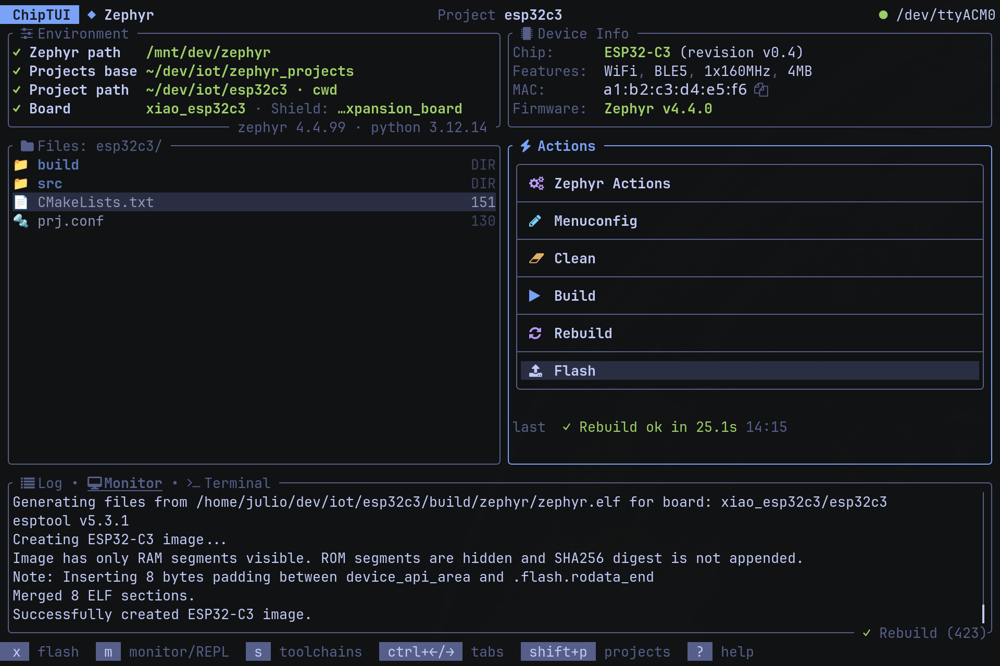
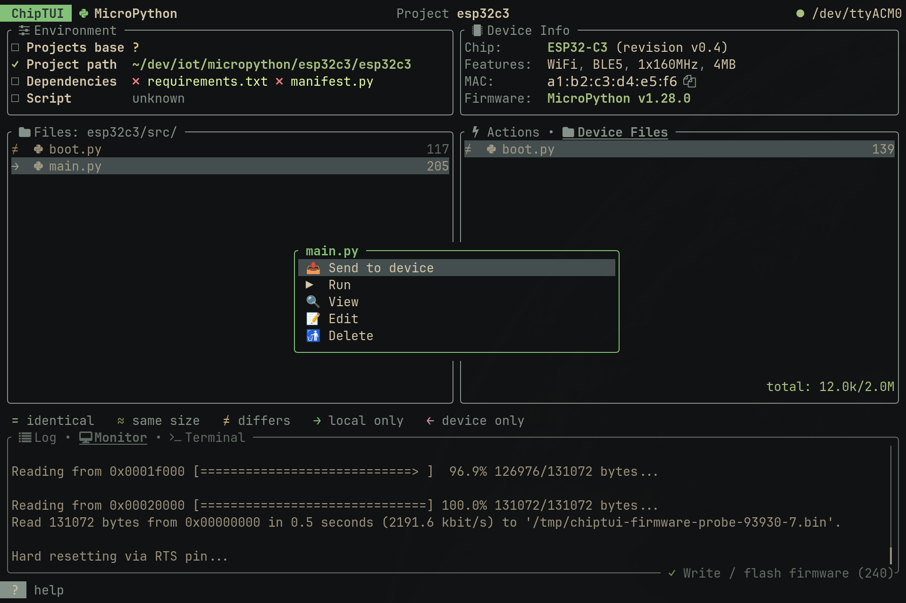
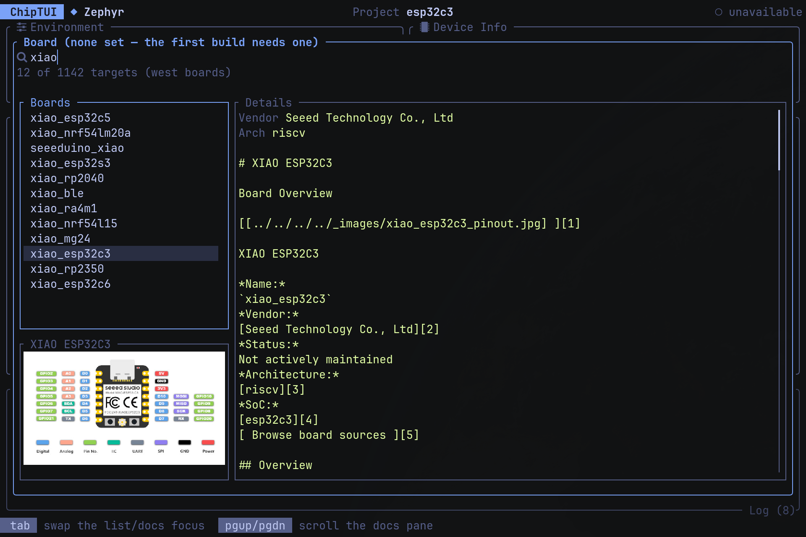
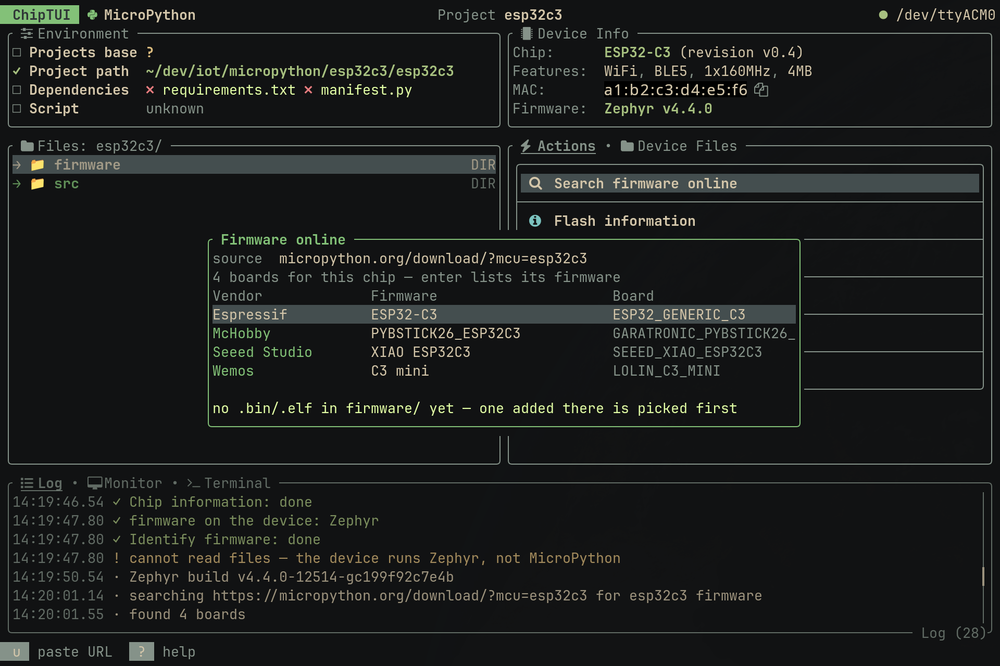

<div align="center">

# ChipTUI

**A keyboard-first terminal cockpit for embedded development.**

[](./LICENSE)
[](https://www.rust-lang.org)
[](https://ratatui.rs)
[](#-status)


<sub><b>Zephyr dashboard</b> — environment checklist and device info on top, project files beside
the build actions, log and monitor below.</sub>

</div>

ChipTUI is an orchestration layer over `mpremote`, `esptool` and `west`. It runs the commands you
already run, streams their output while it happens, and keeps the board's state — port, chip,
firmware, running script — on screen the whole time.

## 📸 Screenshots

<table>
  <tr>
    <td width="33%">
      
      <sub><b>MicroPython dashboard</b> — the local ↔ device browser with sync markers.</sub>
    </td>
    <td width="33%">
      
      <sub><b>Board picker</b> — the west list joined onto the Zephyr docs, picture included.</sub>
    </td>
    <td width="33%">
      
      <sub><b>Firmware search</b> — micropython.org builds for the chip on the port.</sub>
    </td>
  </tr>
</table>

## ✨ Features

- 🎛 **Board and shield pickers with the Zephyr docs** — the `west boards` / `west shields` list
  joined onto the documentation index: the board's picture rendered in the terminal, its page text
  alongside, cached under `$XDG_CACHE_HOME/chiptui/docs/`.
- 🧱 **Zephyr environment installer** — the getting-started guide as a resumable sequence
  (`west init` → `west update` → `west packages pip` → SDK → the toolchains you pick), with
  `cmake`, `dtc` and `pyenv` checked first. An existing installation is adopted.
- ⇩ **Firmware search and download** — searches `micropython.org/download/` for the chip on the
  port, lists that board's builds, downloads into `firmware/` and chains into the write offer.
- 🔎 **Firmware identification** — `esptool chip-id` plus a read of the bootloader region name what
  is flashed: `MicroPython v1.28.0`, `Zephyr v4.0.0`, `ESP-IDF v5.3.1`, `none (erased flash)`.
- 🗂 **Dual-pane file browser** — local and device side by side, comparison by size (`≈`) and by
  sha256 (`=`), coloured unified diff, recursive transfers, `$EDITOR` handoff with re-upload.
- 🖥 **Terminal tab** — your `$SHELL` as a login shell in a full vt100 emulator, born into the
  resolved Zephyr environment. `ctrl+]` detaches and leaves the shell running.
- 🛡 **Confirmations and cancellation** — device operations ask before interrupting a running
  script and offer to restore it, destructive actions name their target, cancelling kills the
  whole process tree.
- 🎨 **Themes, icons, mouse** — a `ratatui-themes` palette (`auto` follows the backend), three icon
  sets on `ctrl+i`, opt-in mouse reporting.

## 🔩 Backends

### 🐍 MicroPython — `mpremote`, `esptool`

- device filesystem: browse, upload, download, recursive copy, create, rename, delete
- sha256 comparison and coloured unified diff against the local tree
- REPL and serial monitor
- esptool: chip id, flash id, flash read, erase and write
- firmware search and download from micropython.org
- `mip` package install; soft reset, run a script, save its output

### 🔷 Zephyr — `west`, `cmake`, `ninja`, Zephyr SDK

- board and shield pickers with the documentation and the board picture
- build, clean, rebuild, menuconfig
- `west flash` through the board's own runner, and `west monitor`
- workspace, venv and SDK installer, `west update`, build dashboard
- project selection from a configured projects folder

Each backend declares its capabilities, and the dashboard, footer, confirmations and help table
are built from that declaration.

## 📦 Install

```bash
git clone https://github.com/julioformiga/chiptui.git
cd chiptui
cargo install --path .
```

`cargo build --release` leaves the binary at `target/release/chiptui`. Toolchain: stable Rust,
edition 2024 (`rustc` 1.97 or newer). System dependencies, per backend:

- 🐍 MicroPython — `pipx install mpremote esptool`
- 🔷 Zephyr — `west`, `cmake`, `ninja` and the SDK, which ChipTUI's installer puts in place
  starting from `cmake` ≥ 3.28.0, `dtc` ≥ 1.4.6 and `pyenv`

## 🚀 Quick start

```bash
cd /path/to/your/embedded/project
chiptui
```

| You run it in…                         | You land on…                                              |
| -------------------------------------- | --------------------------------------------------------- |
| a project ChipTUI knows or recognizes  | the **dashboard**, backend already selected                |
| an **empty** directory                 | the dashboard with the setup prompt, which scaffolds it    |
| anywhere else (`$HOME`, `~/Downloads`) | the **home screen**: your projects, search, a create row   |

Detection is weighted and explainable — *"3.0 of the 4.0 points needed"* — and asks you when two
backends score close together. `shift+P` returns to the project list at any time.

## ⚙️ Configuration

Operator settings live in `~/.config/chiptui/config.toml`:

```toml
[zephyr]
workspace = "~/zephyrproject"      # the Zephyr installation
projects  = "~/zephyrapps"         # where your applications live
# sdk     = "~/zephyr-sdk-0.17.1"  # written by the installer

[micropython]
projects = "~/micropython"

[ui]
theme = "tokyo-night"   # any ratatui-themes palette, or "auto" to follow the backend
icons = "unicode"       # "unicode" (default) | "nerd" | "none"
mouse = true            # opt in to click and wheel reporting
```

The same file holds the project registry — one `[[project]]` block per directory, with the board
and shield picked for it. A project may carry its own `chiptui.toml` (backend override, pinned
workspace, default device), which ChipTUI reads and lets outrank the user config.

## 🗺 Status

Alpha, `v0.1.0`. Core (detection, capabilities, process manager, TUI shell), MicroPython (browser,
sync and diff, REPL and monitor, flash and erase, firmware identification and download, `mip`) and
Zephyr (board and shield selection, build lifecycle, flash, monitor, menuconfig, and the full
workspace/venv/SDK layer) are implemented. Debugging and image signing are on the roadmap — see
[`SPEC.md`](./SPEC.md) §17–§18.

## 📚 Documentation

- [`SPEC.md`](./SPEC.md) — product and architecture reference: goals, backend model, UI/UX, phasing.
- [`AGENTS.md`](./AGENTS.md) — implementation rules and development workflow.

## 🤝 Contributing

Read [`SPEC.md`](./SPEC.md) and [`AGENTS.md`](./AGENTS.md) first — they are authoritative. Keep
backends isolated, keep the UI keyboard-first, and put new behaviour behind a capability.

```bash
cargo fmt --check
cargo check
cargo test
cargo clippy --all-targets --all-features -- -D warnings
```

The suite runs without hardware: fake executables under `tests/fixtures/bin/` stand in for the real
tools, and the UI is rendered through ratatui's `TestBackend`.

## 📄 License

MIT © 2026 Julio Formiga — see [`LICENSE`](./LICENSE).
